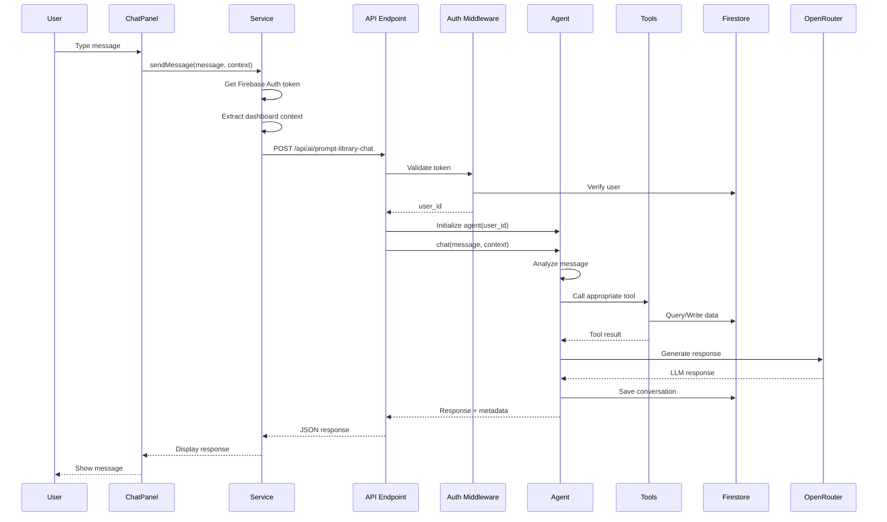
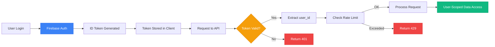
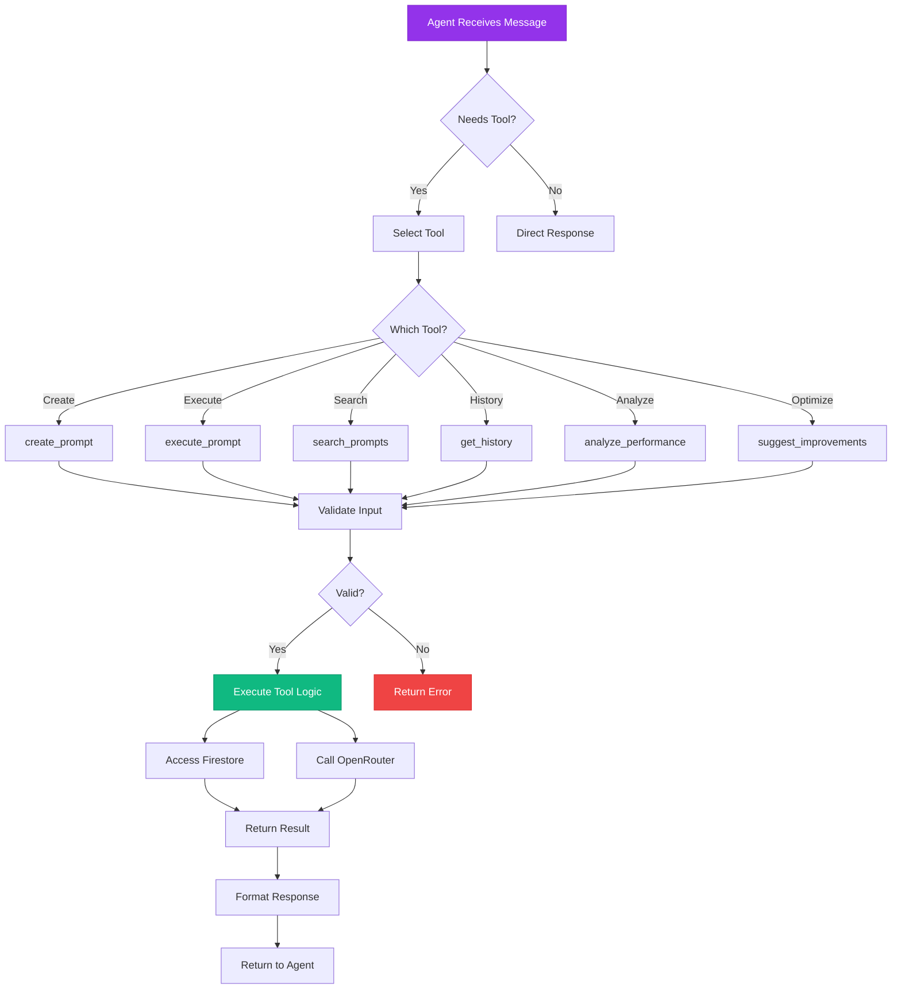
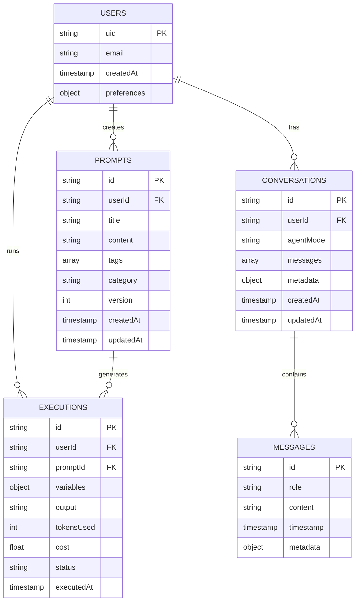
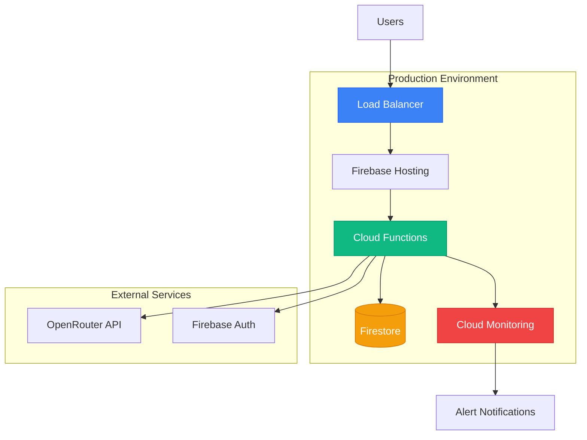

# Phase 2: Prompt Library Agent - System Architecture

**Date**: October 17, 2025  
**Project**: EthosPrompt - Molē AI Agent Phase 2  
**Status**: Architecture Design Complete

---

## 🏗️ SYSTEM ARCHITECTURE OVERVIEW

The Prompt Library Agent is a context-aware AI assistant for authenticated users in the EthosPrompt dashboard. It provides intelligent assistance for prompt engineering tasks including creation, execution, optimization, and performance analysis.

### Key Components
1. **Frontend**: Dashboard chat panel with context awareness
2. **Backend API**: Authenticated endpoint with rate limiting
3. **LangGraph Agent**: Tool-calling agent with 6 specialized tools
4. **Tools**: Prompt operations (CRUD, execute, analyze, optimize)
5. **Storage**: Firestore for conversations, prompts, executions
6. **LLM**: OpenRouter API for agent reasoning and responses

---

## 📊 ARCHITECTURE DIAGRAM

### High-Level Data Flow

```mermaid
graph TB
    subgraph "Frontend - Dashboard"
        User[Authenticated User]
        RightPanel[RightPanel Component]
        ChatPanel[DashboardChatPanel]
        QuickActions[Quick Actions]
        Context[useDashboardContext Hook]
        Service[promptLibraryChatService]
    end
    
    subgraph "Backend - Firebase Cloud Functions"
        API[/api/ai/prompt-library-chat]
        Auth[Authentication Middleware]
        RateLimit[Rate Limiter]
        Agent[PromptLibraryAgent]
        Tools[Tool Registry]
    end
    
    subgraph "Tools - Prompt Operations"
        T1[create_prompt]
        T2[execute_prompt]
        T3[search_prompts]
        T4[get_history]
        T5[analyze_performance]
        T6[suggest_improvements]
    end
    
    subgraph "External Services"
        Firestore[(Firestore)]
        OpenRouter[OpenRouter API]
    end
    
    User --> RightPanel
    RightPanel --> ChatPanel
    ChatPanel --> QuickActions
    ChatPanel --> Context
    ChatPanel --> Service
    
    Service -->|POST + Auth Token| API
    API --> Auth
    Auth -->|Validate Token| Firestore
    Auth --> RateLimit
    RateLimit --> Agent
    
    Agent --> Tools
    Tools --> T1
    Tools --> T2
    Tools --> T3
    Tools --> T4
    Tools --> T5
    Tools --> T6
    
    T1 --> Firestore
    T2 --> Firestore
    T2 --> OpenRouter
    T3 --> Firestore
    T4 --> Firestore
    T5 --> Firestore
    T6 --> OpenRouter
    
    Agent --> OpenRouter
    Agent --> Firestore
    
    Agent -->|Response| API
    API -->|JSON| Service
    Service --> ChatPanel
    ChatPanel --> User
    
    style User fill:#9333ea,stroke:#7e22ce,color:#fff
    style Agent fill:#3b82f6,stroke:#2563eb,color:#fff
    style Tools fill:#10b981,stroke:#059669,color:#fff
    style Firestore fill:#f59e0b,stroke:#d97706,color:#fff
    style OpenRouter fill:#ef4444,stroke:#dc2626,color:#fff
```

---

## 🔄 DETAILED COMPONENT INTERACTIONS

### 1. User Interaction Flow



---

## 🔐 AUTHENTICATION FLOW



---

## 🛠️ TOOL ARCHITECTURE

### Tool Execution Flow



---

## 💾 DATA STORAGE ARCHITECTURE

### Firestore Collections



---

## 🔧 COMPONENT SPECIFICATIONS

### Frontend Components

#### 1. DashboardChatPanel
- **Purpose**: Main chat interface for dashboard
- **Features**: Message history, input field, tool indicators, quick actions
- **State**: Messages, loading, error, conversation ID
- **Context**: Current page, selected prompt, user preferences

#### 2. QuickActions
- **Purpose**: Preset prompts for common tasks
- **Actions**: Create prompt, Optimize prompt, Troubleshoot, Analyze
- **Behavior**: One-click population of chat input

#### 3. useDashboardContext Hook
- **Purpose**: Extract and provide dashboard context
- **Data**: Current page, selected prompt ID, recent executions
- **Updates**: On route change, prompt selection

#### 4. promptLibraryChatService
- **Purpose**: API communication layer
- **Methods**: sendMessage(), sendMessageStream()
- **Features**: Auth token injection, retry logic, conversation persistence

### Backend Components

#### 1. PromptLibraryAgent
- **Pattern**: LangGraph create_react_agent
- **Tools**: 6 specialized tools
- **Memory**: MemorySaver with Firestore persistence
- **LLM**: OpenRouter (x-ai/grok-2-1212:free for testing)

#### 2. Authentication Middleware
- **Validation**: Firebase ID token verification
- **Extraction**: user_id from token claims
- **Errors**: 401 for invalid/missing tokens

#### 3. Rate Limiter
- **Limit**: 100 requests/hour per user
- **Storage**: Firestore (conversation counts)
- **Response**: 429 with retry-after header

#### 4. Tools
- **create_prompt**: Firestore write with validation
- **execute_prompt**: Integration with existing execution logic
- **search_prompts**: Firestore query with filters
- **get_history**: Execution history retrieval
- **analyze_performance**: Metric aggregation
- **suggest_improvements**: LLM-powered optimization

---

## 🚀 DEPLOYMENT ARCHITECTURE



---

## 📈 SCALABILITY CONSIDERATIONS

### Performance Targets
- **Response Time**: <2s for simple queries, <5s for complex
- **Throughput**: 100 requests/second
- **Availability**: 99.5% uptime

### Scaling Strategy
1. **Horizontal Scaling**: Cloud Functions auto-scale
2. **Caching**: Response caching for common queries
3. **Rate Limiting**: Prevent abuse and manage costs
4. **Monitoring**: Real-time metrics and alerts

---

## 🔒 SECURITY ARCHITECTURE

### Security Layers
1. **Authentication**: Firebase Auth token validation
2. **Authorization**: User-scoped data access
3. **Input Validation**: Pydantic schemas
4. **Rate Limiting**: Per-user request limits
5. **CORS**: Restricted origins
6. **Firestore Rules**: Server-side validation

### Data Protection
- **Encryption**: TLS in transit, encrypted at rest
- **Access Control**: User can only access own data
- **Audit Logging**: All requests logged with user_id
- **Token Expiry**: Short-lived tokens (1 hour)

---

## 📊 MONITORING & OBSERVABILITY

### Metrics Tracked
1. **Performance**: Response time, latency, throughput
2. **Errors**: Error rate, error types, stack traces
3. **Usage**: Requests/day, tool usage, conversation length
4. **Costs**: Token usage, API costs, per-user costs

### Alerts Configured
- High latency (>5s)
- High error rate (>5%)
- Rate limit violations
- Cost threshold exceeded ($50/month)

---

## 🎯 ARCHITECTURE DECISIONS

### 1. Agent Pattern: LangGraph create_react_agent
**Rationale**: 
- Native tool calling support
- Structured outputs
- Better for deterministic tasks
- Production-ready (used by major companies)

### 2. Storage: Firestore
**Rationale**:
- Real-time updates
- Scalable
- Integrated with Firebase Auth
- Vector search support

### 3. LLM: OpenRouter
**Rationale**:
- Multiple model support
- Cost-effective
- Free models for testing
- Unified API

### 4. Authentication: Firebase Auth
**Rationale**:
- Integrated with existing system
- Secure token-based auth
- Easy client-side integration
- Built-in user management

---

## 📝 NEXT STEPS

1. ✅ Architecture documented
2. → Implement tool schemas (Task 2.1.3)
3. → Implement individual tools (Task 2.2)
4. → Configure LangGraph agent (Task 2.3)
5. → Build API endpoint (Task 2.4)
6. → Integrate frontend (Task 2.6)

---

**Document Version**: 1.0  
**Created**: October 17, 2025  
**Status**: Complete  
**Next**: Task 2.1.2 - Agent Pattern Selection

