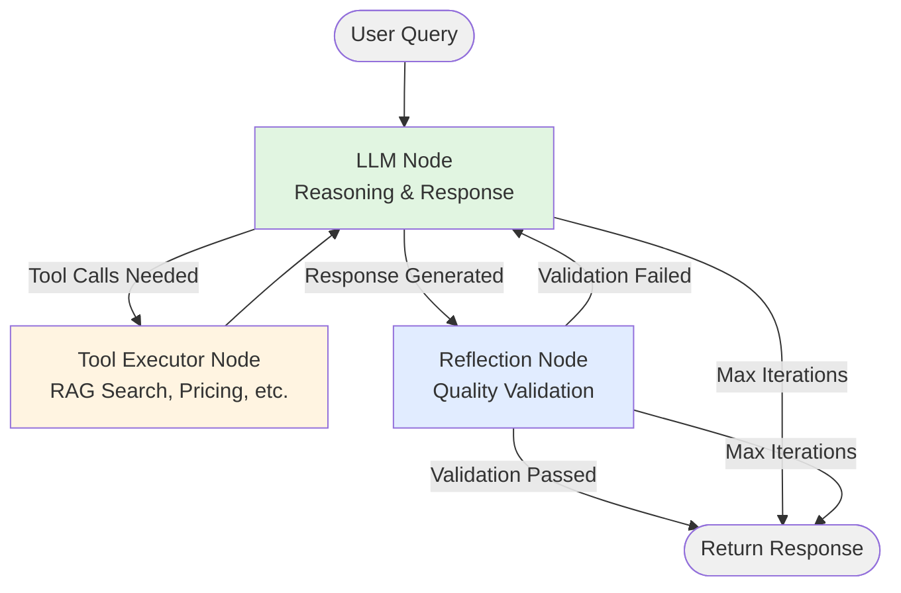

# Marketing Agent Architecture

## Overview

The Marketing Agent is a production-ready, StateGraph-based conversational AI system built with LangGraph. It provides intelligent marketing assistance for EthosPrompt, featuring self-correction capabilities, tool usage, and conversation persistence.

**Key Features:**
- 🔄 Self-correcting responses via reflection mechanism
- 🛠️ RAG-powered knowledge base search
- 💾 Firestore-backed conversation persistence
- 📊 Comprehensive observability and metrics
- ✅ Type-safe (100% mypy compliant)

---

## Architecture Diagram



**Workflow Flow:**
1. **Entry:** User query enters at `llm` node
2. **Tool Loop:** LLM ↔ Tools (for knowledge retrieval)
3. **Reflection Loop:** LLM ↔ Reflect (for quality assurance)
4. **Exit:** Validated response or max iterations reached

---

## State Schema

The agent uses a typed state managed by LangGraph:

### `MarketingAgentState` (TypedDict)

```python
class MarketingAgentState(TypedDict):
    # Message history (LangGraph manages threading with add_messages reducer)
    messages: Annotated[List[BaseMessage], add_messages]

    # Tool execution tracking
    tools_output: List[Dict[str, Any]]
    tool_calls_pending: List[Dict[str, Any]]

    # Workflow control
    next_action: str  # "llm" | "tools" | "reflect" | "end"
    iteration_count: int
    max_iterations: int

    # Quality & validation
    confidence_score: float
    validation_passed: bool
    reflection_feedback: Optional[str]

    # Metadata for context
    conversation_id: str
    page_context: str
    user_id: Optional[str]
    variant: str  # A/B test variant
```

### Field Descriptions

| Field | Type | Purpose |
|-------|------|---------|
| `messages` | List[BaseMessage] | Conversation history (auto-managed by LangGraph) |
| `tools_output` | List[Dict] | Records of tool execution results |
| `tool_calls_pending` | List[Dict] | Queue of tool calls awaiting execution |
| `next_action` | str | Routing directive ("llm", "tools", "reflect", "end") |
| `iteration_count` | int | Current iteration number (prevents infinite loops) |
| `max_iterations` | int | Maximum allowed iterations (default: 10) |
| `confidence_score` | float | Response quality score (0.0-1.0) |
| `validation_passed` | bool | Reflection validation result |
| `reflection_feedback` | str | Feedback for LLM during self-correction |
| `conversation_id` | str | Unique identifier for conversation thread |
| `page_context` | str | Web page context (e.g., "pricing", "services") |
| `user_id` | str | User identifier (optional) |
| `variant` | str | A/B test variant identifier |

---

## Node Responsibilities

### LLM CONVERSION GUIDANCE:
   - **Pricing Queries:** Direct to custom quotation system
   - **General Inquiries:** Guide to contact form
   - **Consultations:** Encourage booking

### 1. **LLM Node** (`llm_node`)

**Purpose:** Core reasoning and response generation

**Location:** [`workflow_nodes.py:14-48`](file:///d:/react/React-App-000740/EthosPrompt/functions/src/ai_agent/marketing/workflow_nodes.py#L14-L48)

**Inputs:**
- `state.messages`: Conversation history
- `llm`: Pre-configured language model instance

**Outputs:**
- `messages`: New AI message (response or tool call request)
- `next_action`: Routing decision ("tools" or "reflect")
- `iteration_count`: Incremented counter
- `tool_calls_pending`: List of tool calls (if any)

**Decision Logic:**
```python
if response has tool_calls:
    next_action = "tools"  # Need to retrieve information
else:
    next_action = "reflect"  # Ready for quality check
```

**Performance Optimizations:**
- Lazy imports for faster cold starts
- Cached model metadata (temperature, max_tokens)
- Streaming support for real-time responses

---

### 2. **Tool Executor Node** (`tool_executor_node`)

**Purpose:** Execute tool calls (RAG search, pricing lookup, etc.)

**Location:** [`workflow_nodes.py:51-114`](file:///d:/react/React-App-000740/EthosPrompt/functions/src/ai_agent/marketing/workflow_nodes.py#L51-L114)

**Inputs:**
- `state.tool_calls_pending`: Tools to execute
- `tools`: List of available tools

**Outputs:**
- `messages`: Tool result messages
- `tools_output`: Execution records (for reflection)
- `tool_calls_pending`: Cleared queue
- `next_action`: Always "llm" (return with results)

**Available Tools:**
1. **`search_kb`**: Semantic search over marketing knowledge base (uses hybrid RAG)
2. **`request_consultation`**: Log consultation request (integrates with quotation system)

**Error Handling:**
- Gracefully handles tool execution failures
- Returns helpful fallback responses
- Logs errors for monitoring

---

### 3. **Reflection Node** (`reflection_node`)

**Purpose:** Quality validation and self-correction

**Location:** [`workflow_nodes.py:154-280`](file:///d:/react/React-App-000740/EthosPrompt/functions/src/ai_agent/marketing/workflow_nodes.py#L154-L280)

**Inputs:**
- `state.messages[-1]`: Final response to validate
- `state.tools_output`: Retrieved context for verification
- `llm`: LLM instance for claim verification

**Validation Checks:**

| Check # | Name | Trigger Condition |
|---------|------|-------------------|
| 1 | **Empty Response** | Response <20 chars |
| 2 | **Missing Follow-ups** | No "might also want to know" section |
| 3 | **Too Long** | Response >2500 chars |
| 4 | **Hallucination (Keywords)** | Mentions removed content (e.g., "digital transformation") |
| 5 | **Hallucination (Prices)** | Prices not in retrieved context |
| 6 | **Brand Voice** | Contains forbidden words ("delve", "tapestry", etc.) |
| 7 | **Missing CTA** | Pricing discussion without consultation suggestion |
| 8 | **LLM-Based Verification** | Claims unsupported by context |
| 9 | **Formatting** | No bullet points in long responses, paragraphs >800 chars |

**Outputs:**
- `validation_passed`: `True` if all checks pass
- `reflection_feedback`: Error messages for regeneration
- `next_action`: Implicit (handled by routing function)

**Self-Correction Flow:**
```
1. Run validation checks → Issues found
2. Set validation_passed = False
3. Compile feedback: "Response FAILED validation. Issues: ..."
4. Router sends back to LLM with feedback
5. LLM regenerates response with guidance
6. Repeat until validated OR max_iterations reached
```

---

## Routing Logic

Routing is handled by two conditional functions in `workflow_graph.py`:

### `route_after_llm(state)` (Lines 53-73)

**Inputs:** Current state
**Returns:** Next node name or `END`

**Logic:**
```python
if iteration_count >= max_iterations:
    return END  # Safety: prevent infinite loops

if next_action == "tools":
    return "tools"  # Retrieve information
elif next_action == "reflect":
    return "reflect"  # Validate response
else:
    return END  # Unknown action
```

**Safety:** Always checks `max_iterations` (default: 10) to prevent runaway loops

---

### `route_after_reflection(state)` (Lines 90-107)

**Inputs:** Current state after validation
**Returns:** `"llm"` for regen or `END` if validated

**Logic:**
```python
if validation_passed == True:
    return END  # Response is good, finish

if iteration_count >= max_iterations:
    return END  # Max attempts, accept response anyway

return "llm"  # Failed validation, regenerate
```

**Graceful Degradation:** If max iterations reached, agent returns best-effort response instead of failing

---

## Data Flow

### Happy Path (No Reflection)

```
1. User Query → LLM Node
2. LLM requests tool call → Tool Executor
3. Tool Executor returns KB results → LLM Node
4. LLM generates final response → Reflection Node
5. Validation passes → END (return response)
```

**Iterations:** 2 (one for tool call, one for response)

---

### Self-Correction Path (Reflection Triggered)

```
1. User Query → LLM Node
2. LLM requests tool call → Tool Executor
3. Tool Executor returns KB results → LLM Node
4. LLM generates response → Reflection Node
5. Validation fails (e.g., missing follow-ups) → LLM Node
6. LLM regenerates with feedback → Reflection Node
7. Validation passes → END
```

**Iterations:** 3 (tool call + 2 response attempts)

---

## Key Design Patterns

### 1. Reducer Pattern (Message Management)

Uses LangGraph's `add_messages` reducer for automatic message threading:

```python
messages: Annotated[List[BaseMessage], add_messages]
```

**Benefit:** LangGraph automatically appends messages, maintaining conversation context

---

### 2. Dependency Injection (Node Binding)

Dependencies (LLM, tools) are bound to nodes using `functools.partial`:

```python
llm_node_bound = partial(llm_node, llm=llm)
reflection_node_bound = partial(reflection_node, llm=llm)
```

**Benefit:** Nodes remain stateless functions, testable in isolation

---

### 3. Circuit Breaker (Max Iterations)

Prevents infinite loops via `max_iterations` check in both routers:

```python
if state.get("iteration_count", 0) >= state.get("max_iterations", 10):
    return END
```

**Benefit:** Graceful degradation under edge cases

---

### 4. State Immutability

Nodes return state **updates** (dicts), not full state:

```python
return {
    "messages": [response],
    "next_action": "reflect",
    "iteration_count": state.get("iteration_count", 0) + 1
}
```

**Benefit:** LangGraph merges updates, preventing accidental state corruption

---

## Persistence Layer

### Firestore Checkpointer

**Implementation:** [`firestore_checkpointer.py`](file:///d:/react/React-App-000740/EthosPrompt/functions/src/ai_agent/marketing/firestore_checkpointer.py)

**Purpose:** Saves conversation state to Firestore for multi-turn persistence

**Collection:** `agent_checkpoints`

**Document Structure:**
```json
{
  "checkpoint_id": "uuid",
  "thread_id": "conversation_id",
  "checkpoint_ns": "namespace",
  "checkpoint": "base64(pickle(state))",
  "metadata": {},
  "created_at": "timestamp"
}
```

**Operations:**
- `aget()`: Load checkpoint by thread_id
- `aput()`: Save checkpoint after each node execution

**Fallback:** `MemorySaver` for testing (in-memory, no persistence)

---

## Observability

### Logging

All nodes emit structured logs:

```python
logger.info("LLM requested 2 tool calls: ['search_kb', 'get_pricing']")
logger.warning("❌ Reflection FAILED: ['Missing follow-up questions']")
logger.info("Validation passed, ending workflow")
```

**Log Levels:**
- `DEBUG`: Internal state transitions
- `INFO`: Major workflow events
- `WARNING`: Validation failures, max iterations
- `ERROR`: Tool execution errors

---

### Metrics (via `monitoring.py`)

Tracked metrics:
- `iteration_count`: Number of LLM invocations
- `reflection_feedback`: Validation issues encountered
- `tool_calls`: Count and types of tools used
- `token_usage`: OpenRouter token consumption
- `estimated_cost_usd`: API cost tracking

Exposed via `AgentResponse.metadata`

---

## Configuration

### Environment Variables

| Variable | Purpose | Default |
|----------|---------|---------|
| `OPENROUTER_API_KEY` | OpenRouter API key (if not using Granite) | Required |
| `USE_GRANITE_LLM` | Use IBM Granite instead of OpenRouter | `false` |
| `WATSONX_API_KEY` | IBM watsonx.ai API key (if Granite) | Required if Granite |
| `WATSONX_PROJECT_ID` | IBM watsonx project ID | Required if Granite |
| `OPENROUTER_USE_MOCK` | Use MockLLM for testing (zero cost) | `false` |
| `OPENROUTER_MODEL` | Model name | `z-ai/glm-4.5-air:free` |

---

### Model Parameters

Hard-coded in `marketing_agent.py` for performance (cached):

```python
self._model_name = "z-ai/glm-4.5-air:free"
self._temperature = 0.6  # Reduced for focused responses
self._max_tokens = 400   # Enforces conciseness
self._streaming = True   # Real-time response
```

**Note:** Granite users can override via `WATSONX_MODEL_ID` env var

---

## Error Handling

### Recovery Strategies

1. **Tool Execution Failure:** Return fallback knowledge base summary
2. **Max Iterations:** Accept best-effort response
3. **LLM API Error:** Retry with exponential backoff (via `retry_logic.py`)
4. **Checkpoint Failure:** Continue with in-memory state

### Error Boundaries

Each node wraps risky operations in try/except blocks:

```python
try:
    results = await tool.ainvoke(args)
except Exception as e:
    logger.error(f"Tool execution failed: {e}")
    return fallback_response
```

---

## Testing Strategy

### Unit Tests
- **`test_reflection_validation.py`**: Reflection node logic
- **`test_marketing_agent_e2e.py`**: End-to-end workflows (6 scenarios)

### Integration Tests
- **`evaluate_reflection.py`**: Reflection mechanism metrics
- **`evaluator.py`**: Golden dataset evaluation (50 queries)

### Mock Infrastructure
- **`mock_llm.py`**: Zero-cost LLM for CI/CD
- Context-aware responses
- Intentional validation failures for reflection testing

---

## Performance Optimizations

### Week 5 Enhancements

1. **Lazy Module Imports** (Task 1.3.1)
   - Defer heavy imports (langgraph, langchain) until first use
   - **Impact:** 500ms-1s cold start reduction

2. **HTTP Session Reuse** (Task 1.4.1)
   - Connection pooling for OpenRouter API
   - **Impact:** 50-100ms per request saved

3. **System Prompt Caching** (Task 1.1.1)
   - Cache static prompt in memory
   - **Impact:** 10-20ms per request

4. **Model Metadata Caching** (Task 1.1.2)
   - Cache temperature, max_tokens at instance level
   - **Impact:** 2-5ms per request

**Total Estimated Improvement:** 600ms-1.2s faster first response

---

## Security Considerations

### PII Protection
- Planned: Presidio-based PII detection (Week 6, Day 27-28)
- Redact before logging and storing

### Input Validation
- Tool arguments sanitized before execution
- Prompt injection resistance via structured messages

### API Key Management
- Keys loaded from env vars (never hardcoded)
- Secrets managed via Firebase Secret Manager in production

---

## Future Enhancements

### Roadmap (Weeks 5-6)

- **Data Drift Detection:** Monitor query distribution shifts
- **RAG Quality Metrics:** MRR, NDCG for retrieval quality
- **PII Detection:** Automated redaction in logs/storage
- **LangGraph Studio Integration:** Visual debugging

---

## Related Documentation

- [Reflection Mechanism Details](file:///d:/react/React-App-000740/EthosPrompt/functions/docs/REFLECTION.md) (To be created)
- [User Guide](file:///d:/react/React-App-000740/EthosPrompt/functions/docs/USER_GUIDE.md) (To be created)
- [Developer Guide](file:///d:/react/React-App-000740/EthosPrompt/functions/CONTRIBUTING.md) (To be created)
- [Week 4 Plan](file:///d:/react/React-App-000740/EthosPrompt/functions/WEEK_4_PLAN.md)
- [Day 17-18 Walkthrough](file:///C:/Users/uthth/.gemini/antigravity/brain/a5abcdc8-4857-49fc-ac45-315f454a8860/walkthrough.md)

---

**Last Updated:** 2025-11-27
**Version:** 1.0
**Maintained By:** AI Agent Development Team
