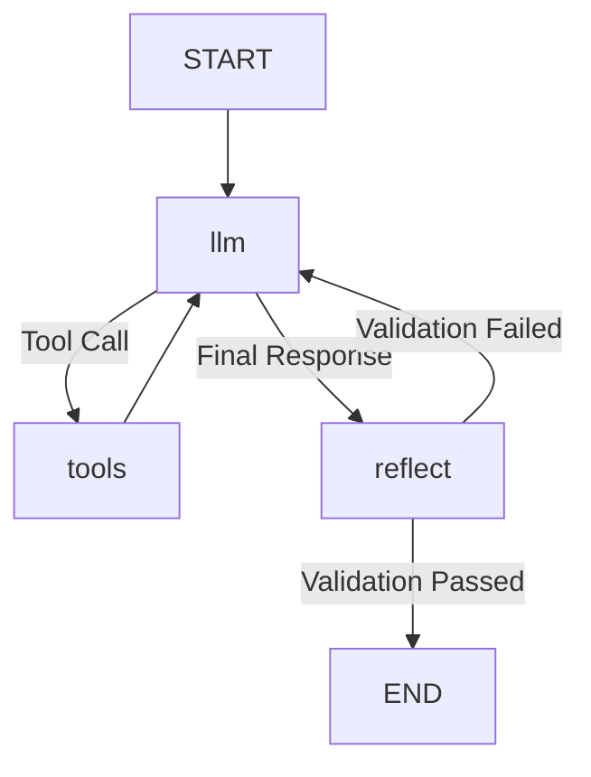

# Marketing Agent Architecture

## Overview
The Marketing Agent (`marketing_agent`) is a specialized AI assistant designed to help visitors understand EthosPrompt's services, features, and pricing. It uses a **LangGraph StateGraph** architecture to manage conversation flow, tool execution, and self-correction.

## Architecture

The agent is built using a cyclic graph architecture with the following nodes:

1.  **LLM Node (`llm`)**: Generates responses or tool calls based on conversation history and context.
2.  **Tool Executor Node (`tools`)**: Executes requested tools (Search KB, Get Pricing, Request Consultation) and returns results.
3.  **Reflection Node (`reflect`)**: Validates the LLM's response for quality, hallucinations, and brand voice adherence.

### Workflow Graph



## State Schema

The agent maintains state using `MarketingAgentState` (TypedDict):

```python
class MarketingAgentState(TypedDict):
    messages: List[BaseMessage]          # Conversation history
    tools_output: List[Dict[str, Any]]   # Tracked tool outputs
    tool_calls_pending: List[Dict]       # Pending tool calls
    next_action: str                     # Control flow (llm, tools, reflect)
    iteration_count: int                 # Loop prevention
    validation_passed: bool              # Quality gate status
    confidence_score: float              # Quality score
    reflection_feedback: Optional[str]   # Feedback for self-correction
```

## Nodes & Responsibilities

### 1. LLM Node
- **Input**: Current state (messages)
- **Logic**: Invokes the LLM (IBM Granite or OpenRouter).
- **Output**: Updates `messages` with AI response. Sets `next_action` to "tools" if tool calls are present, otherwise "reflect".

### 2. Tool Executor Node
- **Input**: `tool_calls_pending`
- **Logic**: Executes `search_kb`, `get_pricing`, or `request_consultation`.
- **Output**: Appends `ToolMessage` to history. Returns to `llm` node.

### 3. Reflection Node
- **Input**: Final AI response
- **Logic**: Performs advanced validation:
    - **Hallucination Detection**: Checks if prices/entities in response exist in retrieved context.
    - **Brand Voice**: Checks for forbidden words (e.g., "delve", "tapestry").
    - **Completeness**: Ensures call-to-action is present for pricing queries.
- **Output**:
    - If valid: Sets `validation_passed=True`, routes to END.
    - If invalid: Adds feedback message, routes back to `llm` for regeneration (up to 3 times).

## Routing Logic

- **After LLM**:
    - If `tool_calls`: -> `tools`
    - If text response: -> `reflect`
- **After Tools**: -> `llm` (to interpret results)
- **After Reflect**:
    - If `validation_passed`: -> END
    - If failed & retries < 3: -> `llm`
    - If failed & retries >= 3: -> END (accept with warning)

## Performance Optimizations

- **Lazy Imports**: Heavy libraries (LangGraph, LangChain) are imported only on first use.
- **Singleton Pattern**: Agent instance is reused across requests.
- **Caching**: System prompts and model metadata are cached in memory.
- **Connection Pooling**: HTTP client for OpenRouter uses keep-alive connections.

## Type Safety

The codebase uses `mypy` for static type checking. Key types are defined in `src/ai_agent/marketing/types.py` and `agent_state.py`.
